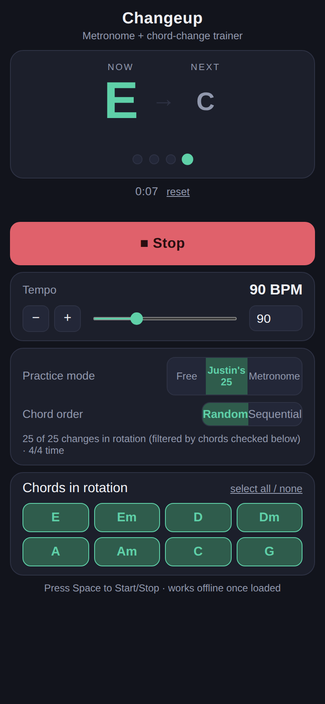

# Changeup

A simple metronome + chord-change trainer for beginner guitar practice. Pick a tempo,
choose which chords you want in rotation (E, Em, D, Dm, A, Am, C, G), and it
clicks along in 4/4 time and prompts you to switch chords every measure
(every 4 beats). A count-in gives you time to get ready before the first
chord.

Try it now, [click here](https://jeffreyp.github.io/changeup/).

<p align="center">
  
</p>

## Controls

- **Start / Stop** — or press <kbd>Space</kbd> (when the page has focus and
  no input is selected).
- **Tempo** — 30–240 BPM. Use the slider, type a number, or nudge it one BPM at
  a time with `−` / `+`.
- **Elapsed time** — counts up while the metronome is running and pauses when
  you stop. Tap **reset** to zero it.
- **Screen stays on** — while playing, the screen is kept awake (where the
  browser supports the Wake Lock API), so you don't have to keep touching the
  phone.

## Practice modes

The **Practice mode** switch picks how chords are chosen. The **Chord order**
switch and the **Chords in rotation** checkboxes only apply to the first two
modes.

### Free

Every measure, the next chord is picked at random from the chords you've
checked. A chord never repeats back-to-back (when more than one chord is
enabled), so you're always making a real change.

With **Sequential** order, the chords cycle in the fixed order
E → Em → D → Dm → A → Am → C → G, skipping any you've unchecked.

Use Free mode to practice any change between the chords you've selected, with
no particular pattern.

### Justin's 25

Based on JustinGuitar's
[25 Most Important Changes](https://www.justinguitar.com/). These are the chord
pairs worth drilling on purpose. The list deliberately leaves out one-finger
changes such as A ↔ Am, D ↔ Dm, and E ↔ Em, since those are easier to pick up
without practice.

Every change in the rotation is one of the 25 pairs, not just every other
measure. The chord you move to must be a curated partner of the chord you're
leaving.

- **Random** — each change is chosen from the valid partners of the current
  chord. Returning to the chord from two measures back is avoided where
  possible, so you keep moving through the list.
- **Sequential** — for each chord, the partners are visited in order and then
  repeat, so the pattern is predictable and easy to memorize.

A change is only available when **both** of its chords are checked. The hint
under the mode switch shows how many of the 25 changes are currently in
rotation. For example, if you check only E, D, and A, you'll see the changes
that use only those three chords. If none of the 25 pairs can be made from your
selection, Start is disabled until you check more chords.

### Metronome

A plain click with no chords, no count-in, and no chord prompts. Use it to
work on timing by itself. The chord display, chord order, and chord
checkboxes are hidden in this mode.

## How a session works

1. **Count-in** — four clicks (in a different tone from the beat) before the
   first chord. The first chord appears during the count-in so you can
   prepare for it.
2. **Measures** — each measure is 4 beats. The first beat is accented, and
   the chord changes on beat 1. The "Next" chord is shown so you can look
   ahead.
3. **Stop** — the chord display returns to "Ready" and the elapsed time
   pauses.

Metronome mode skips the count-in and chord display.

## Run locally

Just open `index.html` in a browser, or serve the folder with any static
server, e.g.:

```
python3 -m http.server
```

## Deploy to GitHub Pages

1. Create a new GitHub repo and push this folder to it:
   ```
   git remote add origin <your-repo-url>
   git push -u origin main
   ```
2. On GitHub: **Settings → Pages → Source**, select the `main` branch and
   `/ (root)` folder, then save.
3. GitHub will publish it at `https://<your-username>.github.io/<repo-name>/`.
